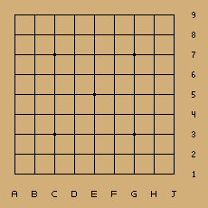
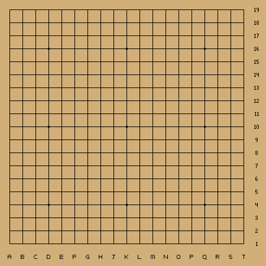

# GoFR


GoFR ("Go [language] For Real", pronounced "gopher") is an entropic register-based programming language whose semantics are based on moves made in the board game [Go](https://en.wikipedia.org/wiki/Go_(game)).

## Semantics

GoFR incorporates elements from the traditional East Asian board game Go to define its semantics. Here's an overview of the language's key features:

### Registers and Functions

- A **register** in GoFR is an object that optionally contains an opcode (function identifier) and a finite number of arguments.
```
---------------------------------------
| Opcode | N_Args | Arg1 | Arg2 | ... |
---------------------------------------
```
- The language supports an infinite number of registers, each identified by a unique integer. At any given point during execution, exactly one register is 'targeted' by the register pointer `R`, which determines what register will be modified by an action on the Go field.
```
----------------------
| R0 | Increment | 1 | <- R
----------------------
| R1 | Identity | 3 |
---------------------
```
- **Functions** in GoFR are operations that take a finite and well-defined number of arguments. Builtin functions like `Identity`, `Increment`, `Multiply`, etc. have specific opcodes, and any user-defined functions will have a larger, runtime-specified opcode. 
- Function arguments are pointers to other registers, **except** in the case of `Identity`, in which the single argument is a literal
- When a the final expected argument is loaded into a function's register, **if the register is pointed to by `R`** it will automatically **execute** per the documentation below
- The language is called **entropic** because each operation (excluding `Identity`) must destroy some amount of information by collapsing to another state, resulting in a less-distinguishable system over time. GoFR's Turing-Completeness relies heavily on the negentropic `Move` instruction (which can create more information than it destroys) and the isentropic `Load` instruction (which can create exactly as much information as it destroys).
- User-defined functions must [curry](https://en.wikipedia.org/wiki/Currying) their arguments to builtin functions to develop higher-level control

### Game of Go Rules

GoFR incorporates rules inspired by the game of Go to govern its execution and manipulation of registers:

- If Black makes a **Ko capture** (a capture of one board space that could be reversed in one move), the current register pointer (`R`) is incremented.
- If White makes a Ko capture, `R` is decremented.
- If either color **passes**, the register at position `R` is cleared back to an uninitialized state.
- If `N` tiles are captured by either color, and the register at position `R` has no function opcode loaded, then its opcode is set to `N`. Otherwise, if it does not have `N_Args` filled (builtins fill this automatically), `N_Args` is set to `N`. Otherwise, `N` is loaded as a pointer to register `#N` into the next available argument slot for register `R`.
- Once the expected number of arguments is loaded into a register, it will execute the function.

These Go-inspired rules add a unique aspect to GoFR's execution and provide a gameplay-like experience to programming.

The above description provides a high-level overview of GoFR's semantics based on the game of Go. More detailed information about the language's syntax, built-in functions, and additional features will be released over time as the language is developed.

### Instruction Reference 

<details>
    <summary> Expand Reference Table</summary>

| n | Name | N_Args | Description | Collapsed State |
|---|---|---|---|---|
| 1 | `Identity` | 1 | A special function for many reasons: it does not get executed, and its argument is a constant value rather than a pointer. If a data load is executed in Go while `R` points to an Identity instruction, it will be overwritten with the new value | `Identity` is already in its collapsed state |
| 2 | `Jump` | 1 | Jumps to the register pointed at by its argument | The `Empty` register |
| 3 | `Move` | 3 | Copies the contents of all registers in the range `[Arg1:Arg2]` to `Arg3`. E.g. if `Move 1 5 6` is executed, registers `R1`, `R2`, `R3`, `R4`, and `R5` will be copied to positions `R6`, `R7`, `R8`, `R9`, and `R10` - maintaining their order | `Identity (Arg2 - Arg1 + 1)` |
| 4 | `Load` | 2 | Loads the data from an `Identity` pointed at by `Arg1` into the next available slot at register `Arg2`, acting like a Go capture. `Load` allows for preparing instructions for `JumpAndExec` as it does not execute fully-loaded functions automatically | `Identity (data @ Arg1)` |
| 5 | `Increment` | 1 | Increments the value pointed at by its argument (will soon be deprecated in favor of Add) | The `Empty` register |
| 6 | `Decrement` | 1 | Decrements the value pointed at by its argument (will soon be deprecated in favor of Subtract) | The `Empty` register |
<!-- | 4 | Move | 2 | Copy the contents of the register at Arg1 to the register at Arg2 |
| 5 | JumpAndExec | 1 | [See description below](#jumpandexec) |
| 6 | Break | 1 | Breaks JumpAndExec loop | -->

#### JumpAndExec

To maintain Turing-Completeness, `JumpAndExec` and `Break` functions are planned. `JumpAndExec` will jump to register `Arg1` and sequentially execute registers until it reaches a `Break` instruction.

### Conditional Jumping

To maintain Turing-Completeness, a `JumpNotZero` function is planned that will jump to register `Arg1` if register `Arg2` is an `Identity` register with a non-zero value.

</details>

### Assembly Example

The following GoFR assembly (the internal translation of Go moves) loads a 
constant 1 (via the `Identity` opcode `1`) into R1, loads an `Increment` operation
(opcode `2`) into R2 with an argument of `1`. This argument points to R1, indicating
that after execution, R2 should contain a constant value of the increment of 1, 
which is 2. This code example is also represented by both of these games of Go: 
<details>
    <summary>Game Animations</summary>

| Step in ASM | Move in Game |
|---|---|
| 1 | 7 |
| 2 | 17 |
| 3 | 19 | 
| 4 | 24 |
| 5 | 25 |



| Step in ASM | Move in Game |
|---|---|
| 1 | 3 |
| 2 | 12 |
| 3 | 13 | 
| 4 | 17 |
| 5 | 19 |


</details>

0. Initial Bank
    ```
    ---------
    | Empty | <- R
    ---------
    ```
1. Load 'Identity' opcode (N_Args is filled automatically for builtins)
    ```
    -----------------------
    | R1 | Identity | N=1 | <- R
    -----------------------
    ```
2. Load the constant '1' into the first argument of R1
    ```
    ---------------------------
    | R1 | Identity | N=1 | 1 | <- R
    ---------------------------
    ```
3. Increment R
    ```
    ---------------------------
    | R1 | Identity | N=1 | 1 |
    ---------
    | Empty | <- R
    ---------
    ```
4. Load 'Increment' opcode
    ```
    ---------------------------
    | R1 | Identity | N=1 | 0 |
    ------------------------
    | R2 | Increment | N=1 | <- R
    ------------------------
    ```
5. Load the register pointer '1' into the first argument of R2
    ```
    ---------------------------
    | R1 | Identity | N=1 | 1 |
    ----------------------------
    | R2 | Increment | N=1 | 1 | <- R
    ----------------------------
    ```
6. When a function is supplied with the correct number of arguments, it is executed automatically. Here, R1 has been set to a constant value of 1 + 1 = 2
    ```
    ---------------------------
    | R1 | Identity | N=1 | 1 |
    ---------------------------
    | R2 | Identity | N=1 | 2 | <- R
    ---------------------------
    ```

### Recursive Assembly Demo

This example computes `5 + 3` recursively, storing the result in `R1`. The IR can be found in [main.ml:_self_replicating_test](gofr/main.ml)


