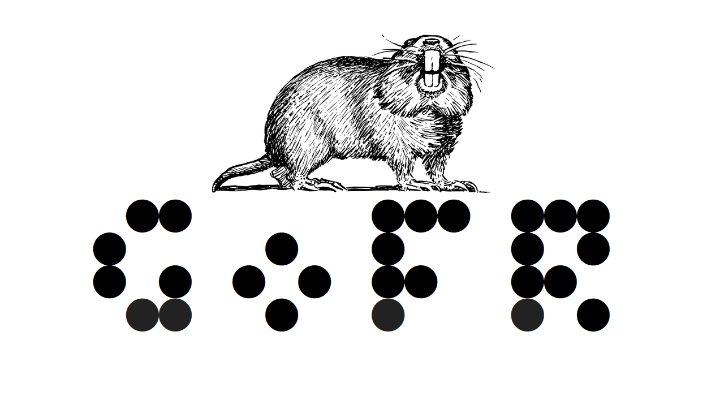

# GoFR



GoFR ("Go [language] For Real", pronounced "gopher") is a register-based programming language whose semantics are based on moves made in the board game [Go](https://en.wikipedia.org/wiki/Go_(game)).

## Semantics

GoFR incorporates elements from the traditional East Asian board game Go to define its semantics. Here's an overview of the language's key features:

### Registers and Functions

- A **register** in GoFR is an object that optionally contains an opcode (function identifier) and a finite number of arguments.
```
---------------------------------------
| Opcode | N_Args | Arg1 | Arg2 | ... |
---------------------------------------
```
- The language supports an infinite number of registers, each identified by a unique integer. At any given point during execution, exactly one register is 'targeted' by the register pointer `R`, which determines what register will be modified by an action on the Go field.
```
--------------------------
| R0 | Increment | 1 | 1 | <- R
--------------------------
| R1 | Identity | 3 |
---------------------
```
- **Functions** in GoFR are operations that take a finite and well-defined number of arguments. Builtin functions like `Identity`, `Increment`, `Multiply`, etc. have specific opcodes, and any user-defined functions will have a larger, runtime-specified opcode. 
- Function arguments are pointers to other registers, **except** in the case of `Identity`, in which the single argument is a literal
- When a function is executed, its output is stored in the register that contained the function, with the new opcode being the `Identity` function and the singular argument being the result. Only values in `Identity` registers may be used in computations
- User-defined functions must [curry](https://en.wikipedia.org/wiki/Currying) their arguments to builtin functions to develop higher-level control

### Game of Go Rules

GoFR incorporates rules inspired by the game of Go to govern its execution and manipulation of registers:

- If Black makes a **Ko capture** (a capture of one board space that could be reversed in one move), the current register pointer (`R`) is incremented.
- If White makes a Ko capture, `R` is decremented.
- If either color **passes**, the register at position `R` is cleared back to an uninitialized state.
- If `N` tiles are captured by either color, and the register at position `R` has no function opcode loaded, then its opcode is set to `N`. Otherwise, if it does not have `N_Args` filled (builtins fill this automatically), `N_Args` is set to `N`. Otherwise, `N` is loaded as a pointer to register `#N` into the next available argument slot for register `R`.
- Once the expected number of arguments is loaded into a register, it will execute the function.

These Go-inspired rules add a unique aspect to GoFR's execution and provide a gameplay-like experience to programming.

The above description provides a high-level overview of GoFR's semantics based on the game of Go. More detailed information about the language's syntax, built-in functions, and additional features will be released over time as the language is developed.

### Assembly Example

The following GoFR assembly (the internal translation of Go moves) loads a 
constant 0 (via the `Identity` opcode `0`) into R0, loads an `Increment` operation
(opcode `1`) into R1 with an argument of `0`. This argument points to R0, indicating
that after execution, R1 should contain a constant value of the increment of 0, 
which is 1.

0. Initial Bank
    ```
    ---------
    | Empty | <- R
    ---------
    ```
1.  Load 'Identity' opcode (N_Args is filled automatically for builtins)
    ```
    -----------------------
    | R0 | Identity | N=1 | <- R
    -----------------------
    ```
2. : Load the constant '0' into the first argument of R0
    ```
    ---------------------------
    | R0 | Identity | N=1 | 0 | <- R
    ---------------------------
    ```
3. : Increment R
    ```
    ---------------------------
    | R0 | Identity | N=1 | 0 |
    ---------
    | Empty | <- R
    ---------
    ```
4. : Load 'Increment' opcode
    ```
    ---------------------------
    | R0 | Identity | N=1 | 0 |
    ------------------------
    | R1 | Increment | N=1 | <- R
    ------------------------
    ```
5. : Load the register pointer '0' into the first argument of R1
    ```
    ---------------------------
    | R0 | Identity | N=1 | 0 |
    ----------------------------
    | R1 | Increment | N=1 | 0 | <- R
    ----------------------------
    ```
6. : When a function is supplied with the correct number of arguments,
it is executed automatically. Here, R1 has been set to a constant value of
0 + 1 = 1
    ```
    ---------------------------
    | R0 | Identity | N=1 | 0 |
    ---------------------------
    | R1 | Identity | N=1 | 1 | <- R
    ---------------------------
    ```
